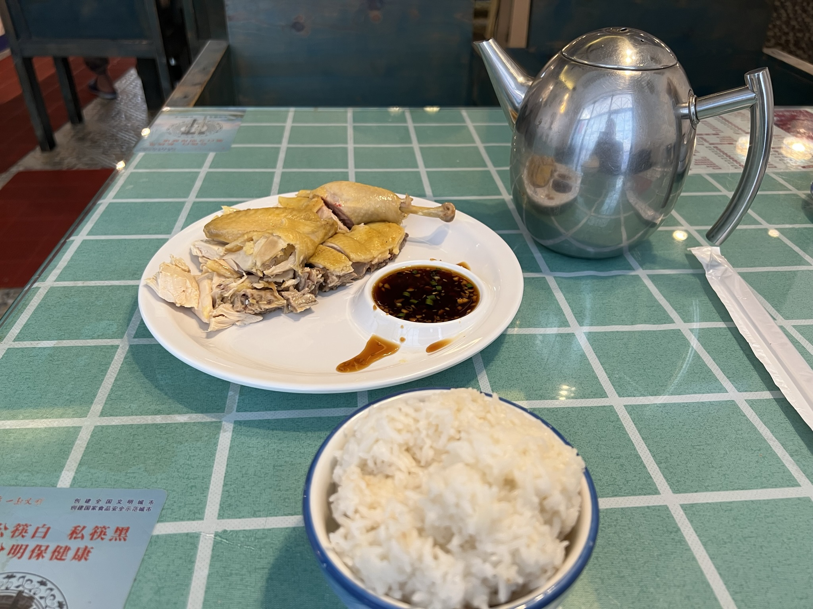


{
    "autoplay": false,
    "width": "auto",
    "mode": "circulation",
    "showlrc": 3,
    "mutex": true,
    "listmaxheight": "100px",
    "preload": "metadata",
    "music": [
            {
                "title": "飞机场的1030",
                "author": "陶喆",
                "url": "/media/飞机场的10_30 - 陶喆.mp3",
                "pic": "/media/飞机场的10_30 - 陶喆.webp",
                "lrc": "/media/飞机场的10_30 - 陶喆.lrc"
            },
            {
                "title": "Rocket Man",
                "author": "Elton John",
                "url": "/media/Rocket Man - Elton John.mp3",
                "pic": "/media/Rocket Man - Elton John.jpg",
                "lrc": "/media/Rocket Man - Elton John.lrc"
            }
    ]
}


# 正文

## 出发前

五一趁着黄金周从阳朔回了深圳（呵！听听这是人话吗），准备躺平（出门玩够了，会特别想回家里宅着）。这时候微信亮了，一个海口的朋友告诉我5月份文昌有火箭发射。我纠结了一下午，拍拍屁股开始准备行程。

这次旅行除了火箭观礼，其他的行程，我没做任何攻略，打算边发展边规划。从广西回来后，我对各大平台的营销和评分已经无感了，打算随遇而安，见机行事。

不知道是什么原因，突然有点怕坐飞机，总担心它会像死神来了的剧情一样出事故（明明去哈尔滨那么远都没多想啊）。飞机安全落地后长舒一口气，感恩。

## 开始边走边规划

由于今年旅行的密度很高，我逐渐形成了自己的旅行套路。

例如我的旅游线路一定包含 
博物馆：了解历史，购买文创
规划展览馆：了解城市规划



## 一些思考

自己一个人旅行，会倒逼着自己做出选择。这对于从小就只会低头走路的我来说，是十分困难的挑战。
收集信息 -> 评估信息 -> 猜测状态 -> 得出结论 -> 做出选择 -> 执行

旅行时，每天都在开销，而我现在又没收入，所以自己每天都处在一个状态：

回头一看，其实梦想清单里面的事情并一定都很难，一直处于拖延的原因，可能是自己不敢做出选择，而做选择是需要跳出舒适圈的。

渐渐的，我掌握了自己旅行的一点套路。我每次是因为某件事情特别吸引我，才过去。其他的打卡点，我都是抱着顺路看看的心态。并且在行程快要结束时会总结自己还有什么遗憾的事情没做，想办法get it done。

游行后发现还是好人居多呀！

火箭发射🚀 白色的火焰 黑夜宛如白昼 

最佳观测点：淇水湾海滩 🏖️  ，科普中心广场

自己拍摄几乎没什么作用，现场看和感受就行了，总有人拍得更好。



# 感悟

# 美食推荐

糟粕醋鱼汤（我去的店叫优鲜鱼汤）

老爸茶（类似广州的下午茶，海口挺多）

咱们的文昌鸡并没有汕头鸡好吃 = =


# 图片
